<div align="center">
    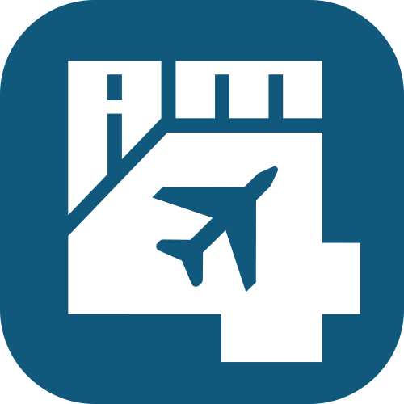
    <h1>Airline Manager 4 Bot</h1>
    <p>Desktop bot for the web version of <a href="https://www.airlinemanager.com">Airline Manager 4</a>: departs your aircraft, buys fuel and CO2 when they are cheap, keeps the fleet repaired, runs marketing campaigns, fits business and first class seats to each route, gives parked aircraft a route and buys the best-value aircraft. Desktop window and web dashboard.</p>
    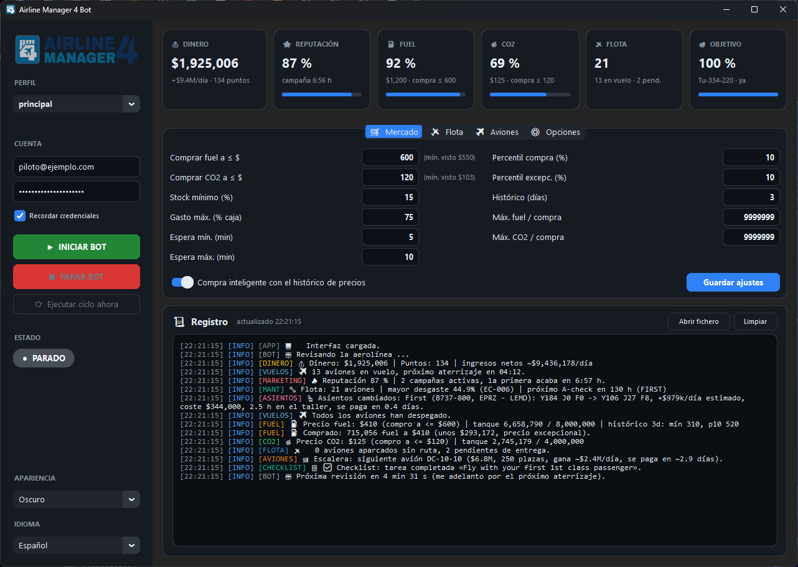
</div>

## Features

- ✔️ Auto depart all aircraft.
- ✔️ Auto buy fuel and CO2. Smart buy keeps a price history (`data/prices.json`, fed by the market chart, so it covers the last 5 hours even when the bot was off) and fills the tanks when the price is in the low percentile of the last days. A fixed "always buy at" price and a minimum stock top-up complete the rule. Buys once per 30-minute price window and never more than your free storage, your cash reserve or the per-purchase cap allow.
- ✔️ Wakes up early when an aircraft is about to land or the market price is about to change, instead of waiting the full interval.
- ✔️ Auto repair aircraft above a wear percentage and plan A-checks when the hours to check run low.
- ✔️ Create routes for parked aircraft: searches the busiest routes from your hub, checks the aircraft can fly them, uses the game's autoprice.
- ✔️ Buy the best-value aircraft (estimated daily profit divided by price) or a model you name, never below your cash reserve and never while aircraft sit parked without a route.
- ✔️ Growth ladder: by default the goal is automatic. The bot saves for the aircraft that earns the most per day among those costing at most `ladder_budget_days` of income and paying back within `ladder_max_payback` days, so it climbs to bigger aircraft as income grows (today: MD-81, then MC-21-300, then MC-21-400). You can also pick a fixed goal (A330, B777, B747, A380 ...). Meanwhile it only buys a smaller aircraft when it pays for itself in less than half the time left to the goal. Shows progress, net income per day and the estimated arrival.
- ✔️ Profit estimates calibrated on the airline's own flights: the bot measures the real seat occupancy every cycle (it follows the airline reputation) and uses the price it actually pays for fuel and CO2.
- ✔️ Keeps free hangar slots: buys one more slot when they run low.
- ✔️ Marketing: keeps an airline reputation campaign (level and duration configurable) and the cheap eco-friendly campaign running, but only while they pay. Seat occupancy follows the reputation, so a campaign multiplies the ticket income the bot measures by the points it adds over the current reputation; if that does not beat its price by 20 %, it is skipped (with a small fleet in realism, campaign 4 does not pay and the eco-friendly one does). A reputation campaign waits until 6 h of income have been measured.
- ✔️ Fuel and CO2 stock in days: it never holds more than `stock_days` of what the fleet burns (twice that at an exceptional price), so the money goes to new aircraft instead of sitting in the tanks for weeks. The net income counts fuel and CO2 when they are burnt, not when they are bought.
- ✔️ Seat layout by route demand: when an aircraft sits at the base, the bot reads its route's daily Y / J / F demand and gives it first and business seats up to that demand, the rest economy (per economy slot first pays the most, then business). It only modifies an aircraft when the cost plus the workshop time pays back within `seats_max_payback` days.
- ✔️ Aircraft upgrades: in the same workshop visit it works out what each permanent upgrade of the game would earn on that aircraft's route (speed +10 % = more flights a day as far as demand allows, fuel -10 %, CO2 -10 %) and installs those that pay back within `seats_max_payback` days.
- ✔️ Watches the game's checklist: logs the open tasks, reports the completed ones and collects rewards when the game offers a button. While "fly your first 1st class passenger" ($100,000) is open, the seat step counts that reward on the first aircraft it can give first-class seats.
- ✔️ Exceptional prices (lowest percentile of the history) fill the tanks with all the cash above the reserve.
- ✔️ The lowest fuel and CO2 prices ever seen appear next to the price boxes, as a reference of what "cheap" really is.
- ✔️ Hover tooltips on every button and setting; the full guide is below, in Spanish like the app.
- ✔️ Dry run mode: logs every purchase, repair, route or order it would make without spending anything.
- ✔️ Dashboard window: statistic tiles (money and income, reputation and campaign time left, fuel and CO2 tanks with prices, fleet, savings goal), the settings tabs and a colour-coded, tagged log that is always visible. Dark and light themes.
- ✔️ Web dashboard: the same tiles, log, controls and settings in a browser, also on your phone from the home network (with a token). It can also run without the desktop window (`python src/main.py --web`), for a machine that stays on all day.
- ✔️ Telegram notifications for every action, errors and a daily summary.
- ✔️ Automatic restart after a crash, so it can run unattended for days.
- ✔️ Random interval between checks, optional headless Chrome, optional persistent browser session.
- ✔️ Credentials live in `config/secrets.ini`, which is git-ignored.

<details>
<summary><b>📸 All screenshots</b> (desktop window and web dashboard, every tab, dark and light)</summary>

| Desktop window | Web dashboard |
| --- | --- |
|  | 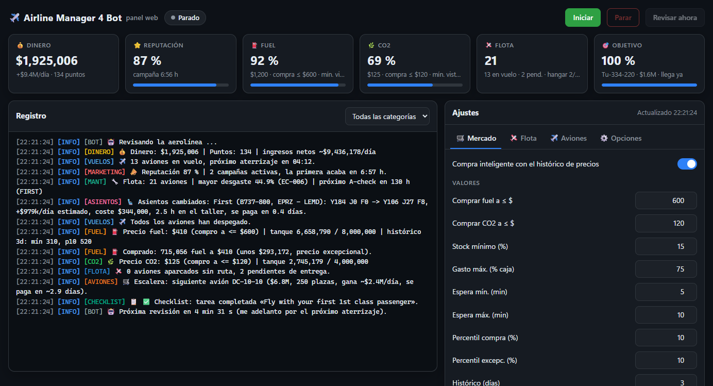 |
| 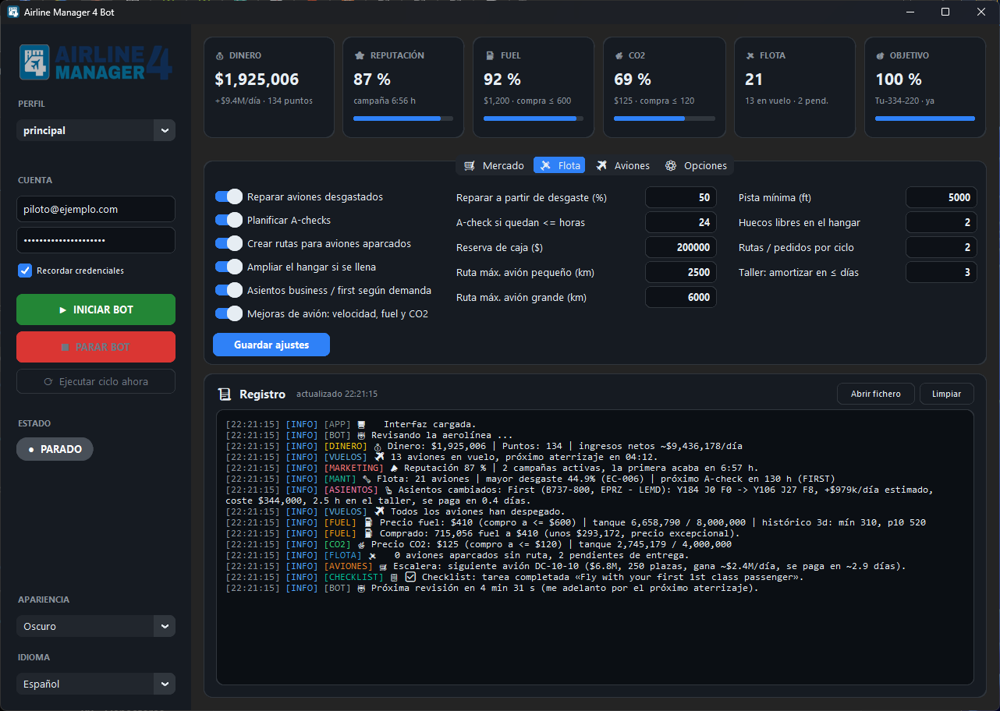 | 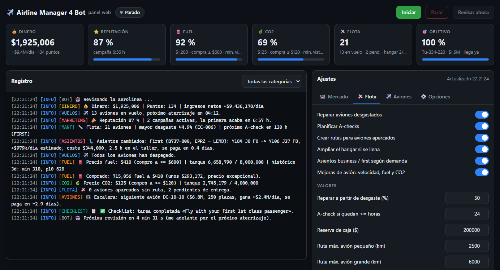 |
| 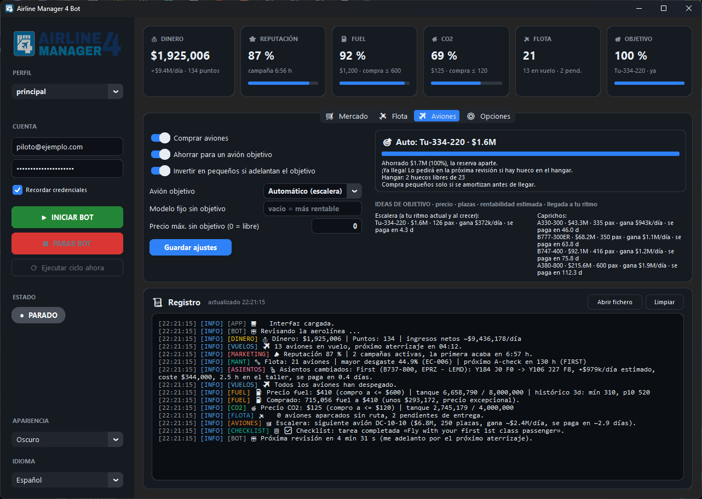 | 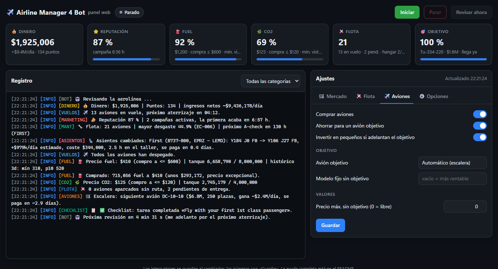 |
| 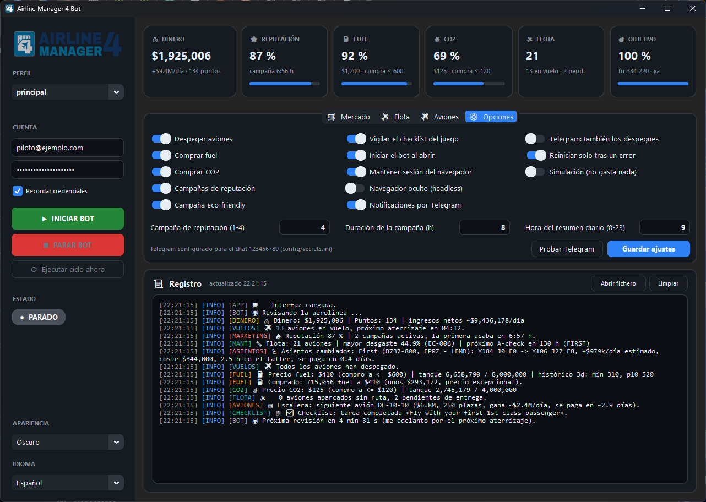 | 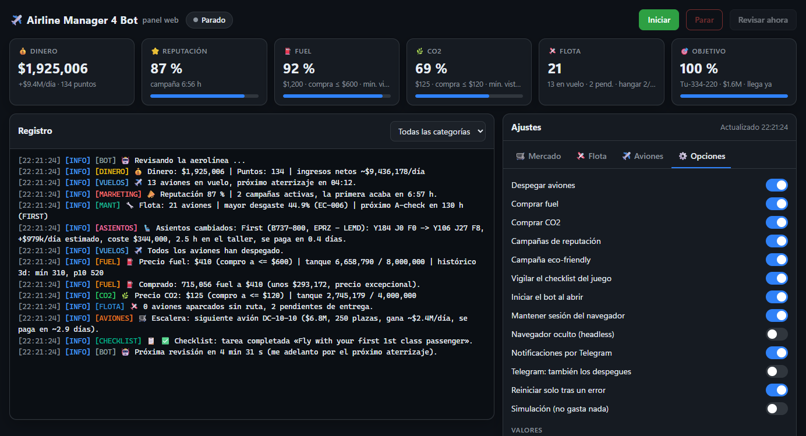 |
| 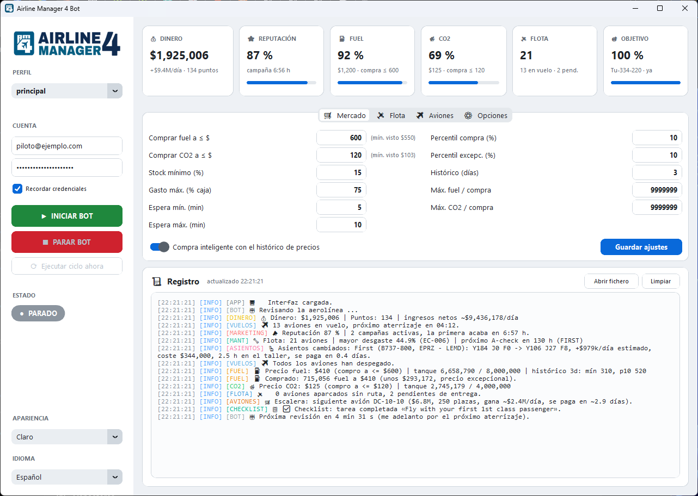 | 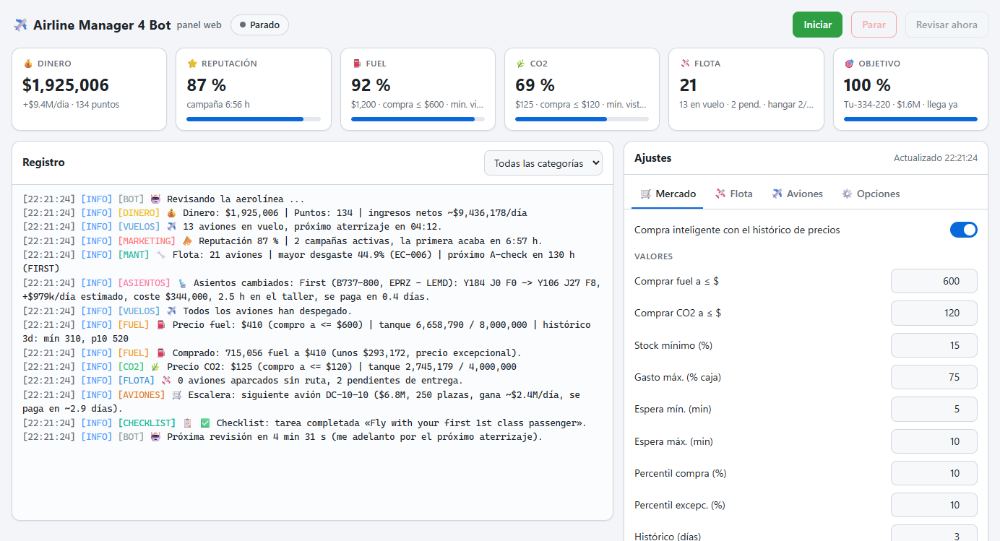 |
| | 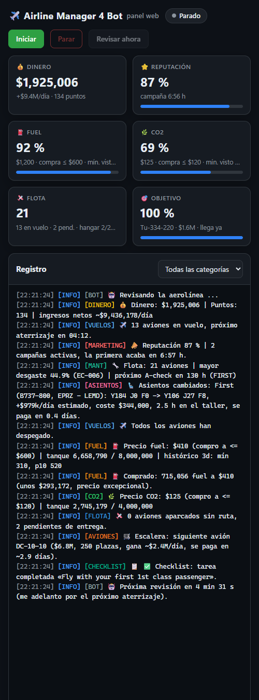 |

The images use sample figures and an example account. To refresh all of them after a change: `.venv\Scripts\python.exe scripts\screenshots.py` (it never starts the bot and works while the bot is running).
</details>

Works in both game modes: the bot reads the mode of each account (easy: flights at 1.5x speed; realism: real speed and cheaper tickets) and adapts its profit, route and seat calculations to it.

The window and the web dashboard speak Spanish or English (**Idioma / Language** in the sidebar, switched live); choosing a language also puts your game account in that language at the next check (`[options] sync_game_language = off` to keep them apart). The log and the Telegram messages are in Spanish for now. The game itself can be in any language: the bot finds everything by ids, classes and click handlers, never by visible text (tested with the game in English and in Spanish).

## Requirements

- Python 3.10 or newer.
- Google Chrome. Selenium Manager downloads the matching chromedriver by itself, nothing to install by hand.

## Install

```bash
git clone https://github.com/JavierOlmedo/AirlineManager4Bot.git
cd AirlineManager4Bot
python -m venv .venv
.venv\Scripts\activate        # Windows
source .venv/bin/activate     # macOS / Linux
pip install -r requirements.txt
```

## Run

```bash
python src/main.py
```

1. Type your e-mail and password in the sidebar. Leave them empty if you prefer to log in by hand in the Chrome window.
2. Adjust the thresholds and switches. **Simulación** (dry run) is off by default; switch it on in the *Opciones* tab if you want to watch what the bot would do without spending anything.
3. Press **INICIAR BOT**.

You can also copy `config/secrets.example.ini` to `config/secrets.ini` and fill it in.

## Profiles (several airlines)

Each profile is one game account with its own settings, credentials, Chrome session, data, log and web dashboard port, so several airlines can run at the same time.

- **Perfil** at the top of the sidebar: pick another profile to open it in its own window, or **➕ Nuevo perfil…** to create one. A new profile copies your current settings (with "start on launch" off so you can type the new account first), keeps only the Telegram part of the secrets (same chat, messages tagged `[name]`), gets the next free web port and a desktop shortcut `AM4 Bot (name)`.
- From the command line: `python src/main.py --profile realismo` (created the first time), `python src/main.py --web --profile realismo`, `scripts\web.bat -Perfil realismo`, `scripts\web_parar.bat -Perfil realismo`.
- The main profile keeps the usual files (`config/`, `data/`); the others live in `profiles/<name>/` (git-ignored).

## Running on a Raspberry Pi (24/7)

Both profiles can run as Linux services on a Raspberry Pi (tested on a Pi 4 with Raspberry Pi OS 64-bit, Debian 12) while you develop on Windows:

1. On the Pi: `sudo apt install chromium chromium-driver python3-venv` (Google ships no chromedriver for ARM, the bot uses the system one).
2. On Windows, once: create a key with `ssh-keygen -t ed25519 -f %USERPROFILE%\.ssh\am4bot_pi` and append the `.pub` line to `~/.ssh/authorized_keys` on the Pi.
3. `scripts\desplegar_pi.bat -Instalar` copies the code (src, assets, scripts, requirements; never data, credentials or Chrome sessions), creates the virtualenv and installs the systemd services `am4bot@principal` and `am4bot@secundario` (web mode, start at boot, restart on failure). Each machine keeps its own `config/`, `profiles/` and `data/`: copy them once if you move an airline to the Pi.
4. Pi settings: `headless = on`, `start_on_launch = on`, `[web] host = 0.0.0.0` plus a `[web] token` in each profile's secrets. Open the dashboards from Windows at `http://<pi>:8744/?token=...` and `:8745`.
5. On Windows add `[web] remote_instances = <pi ip>` (same token): the window and web mode then refuse to start a bot that already runs on the Pi, so an airline is never played twice.
6. After every code change: `scripts\desplegar_pi.bat` (copies and restarts the running services; `-SinReiniciar` only copies). Logs: `journalctl -u am4bot@principal -f` or each profile's `data/logs/am4bot.log` on the Pi.

## Web dashboard

<div align="center"></div>

While the app is open, the same dashboard is served at <http://127.0.0.1:8744/> (click **Abrir el panel web** in the sidebar): statistic tiles, the live log with a category filter, start / stop / check now, and every setting of the four tabs. Switches save at once, numbers with **Guardar**; both interfaces stay in sync.

- **Only this PC by default.** To open it from your phone or another computer at home, set `host = 0.0.0.0` in the `[web]` section of `config/settings.ini` and put a long random `token` in the `[web]` section of `config/secrets.ini`. Then open `http://<this-pc-ip>:8744/?token=<token>` once on each device (it remembers the token in a cookie). Without a token the server refuses to listen beyond `127.0.0.1`.
- **No desktop window:** `python src/main.py --web` runs the bot and the web dashboard only (credentials from `config/secrets.ini`, log also in the console). Handy on an always-on machine.
- **Windows shortcuts:** `scripts\web.bat` opens the dashboard and, when no copy of the bot is running, starts it in web mode in a console window; `scripts\web_parar.bat` stops whichever copy is running (web mode or desktop app) cleanly, closing Chrome too. Point two desktop shortcuts at them (icons `assets\web.ico` and `assets\web_parar.ico`). Only one copy of the bot can run at a time: a second one notices the first and does not start its bot.
- `[web] enabled = off` turns the web dashboard off; `port` changes the port.
- The page never shows the game password or the Telegram token, it uses no external scripts or fonts, and it refuses requests from other sites.

## What a cycle does

1. Reads money, points and the in-flight countdowns.
2. Reads the reputation and starts the enabled marketing campaigns that are not running and pay (`marketing_campaign` 1-4 for `marketing_hours`, plus the eco-friendly one). While all of them run, the page is only checked again when the first one ends; one that does not pay is looked at again within the hour.
3. Reads the maintenance plan: repairs aircraft at or above `repair_wear_pct`, plans an A-check when hours to check are at or below `check_hours_min`. This happens before departures so that a landed aircraft can still be serviced at the base.
4. Seat layout: looks at up to 8 aircraft waiting at the base (each at most twice a day) and modifies at most 2 whose layout pays back within `seats_max_payback` days.
5. Departs every aircraft that is ready.
6. Reads the fuel and CO2 market, stores the chart prices in the history and buys when the price is at or below the higher of `fuel_price_good` / `co2_price_good` and the `buy_percentile` of the last `history_days`. Below `min_stock_pct` it tops up at any price. It never holds more than `stock_days` of the measured use (twice that at an exceptional price). Each purchase spends at most `market_max_spend_pct` of the cash above the reserve, and only once per 30-minute price window (remembered across restarts).
7. Gives parked aircraft a route (busiest routes first, counting business and first demand when the seat layout is on; up to `route_max_distance` km, or `route_max_distance_big` for aircraft of 150+ seats, never beyond the aircraft's range; runway at least `route_min_runway` ft) and, when nothing is parked, buys one aircraft or keeps saving for `goal_model`.
8. Reads the checklist when its counter changes (or every 6 hours).
9. Waits a random time between `cycle_min_minutes` and `cycle_max_minutes`, or less when an aircraft is about to land or the price is about to change, and starts again.

Aircraft, campaigns, workshop, hangar and normal fuel or CO2 purchases never go below `cash_reserve`; only repairs, A-checks, the top-up of a nearly empty tank and the route of an aircraft already bought may use it. At most `fleet_actions_per_cycle` routes or orders happen per cycle.

## Running unattended

- **Iniciar el bot al abrir** (Opciones) starts the bot as soon as the app opens.
- **Reiniciar solo tras un error** (Opciones, on by default) restarts the bot a couple of minutes after a crash, doubling the wait on repeated failures up to 30 minutes.
- Put the desktop shortcut in the Windows Startup folder (`shell:startup`) so the app comes back after a reboot.
- Telegram sends the daily summary and every action, so you can watch it from your phone.

## Telegram notifications

1. Create a bot with [@BotFather](https://t.me/BotFather) and copy its token.
2. Send your new bot any message, then open `https://api.telegram.org/bot<TOKEN>/getUpdates` and read the `chat.id`.
3. Put both values in `config/secrets.ini`:

```ini
[telegram]
bot_token = 123456789:AAExampleTokenFromBotFather
chat_id = 123456789
```

Then, in the app's *Opciones* tab, keep **Notificaciones por Telegram** on and press **Probar Telegram**.

You get a message for every purchase, route, order, repair or A-check (also in dry run, marked as such), when the bot starts, stops or crashes, and one daily summary after `summary_hour` with the balance, stocks, fleet and the day's actions. Switch **Telegram: also departures** on if you want a message for every departure too.

## Guía de la app (en español)

El bot revisa tu aerolínea cada pocos minutos y en cada revisión, por este orden: lee el dinero, mantiene en marcha las campañas de reputación, planifica reparaciones y A-checks de los aviones que están en base, ajusta sus asientos (turista, business y first) a la demanda de su ruta, despega todo lo que esté listo, mira el mercado de fuel y CO2 y compra si el precio es bueno, da ruta a los aviones aparcados y, si no queda ninguno aparcado, compra un avión o ahorra para el objetivo. De vez en cuando mira el checklist del juego. Todo lo que hace aparece en el Registro y, si quieres, en Telegram.

Pasa el ratón por encima de cualquier ajuste de la app para ver esta misma explicación.

### Barra lateral

- **Perfil**: Cada perfil es una aerolínea (una cuenta del juego) con sus propios ajustes, credenciales, sesión de Chrome, datos y panel web. Elige otro para abrirlo en otra ventana (pueden ir a la vez) o crea uno nuevo con «➕ Nuevo perfil…»: copia tus ajustes actuales y pone un acceso directo en el escritorio.
- **Correo y contraseña**: Tu correo y contraseña de Airline Manager. Si marcas «Recordar credenciales» se guardan en config/secrets.ini, que no se sube a git. Si los dejas vacíos, inicia sesión a mano en Chrome.
- **Recordar credenciales**: Guarda el correo y la contraseña en config/secrets.ini para no escribirlos cada vez. Al desmarcarlo se borra ese fichero.
- **INICIAR BOT**: Abre Chrome, inicia sesión y empieza a revisar la aerolínea en bucle. Guarda los ajustes antes de arrancar.
- **PARAR BOT**: Para el bot cuando termine el paso que esté haciendo y cierra Chrome.
- **Ejecutar ciclo ahora**: Se salta la espera y hace una revisión completa ahora mismo.
- **Estado**: Estado del bot y cuenta atrás hasta la próxima revisión. Tras un error verás el motivo y la cuenta atrás del reinicio automático.
- **Abrir el panel web**: Abre en el navegador el panel web, con las mismas tarjetas, registro y ajustes (ver «Panel web» más abajo).
- **Apariencia**: Tema claro, oscuro o el del sistema.
- **Idioma**: Idioma de la ventana y del panel web (español o inglés). También cambia el idioma de tu cuenta en el juego en la siguiente revisión (el bot funciona con el juego en cualquier idioma). El registro y Telegram siguen en español.

### Tarjetas de estadísticas (arriba)

- **Dinero**: Dinero de la aerolínea. Debajo, los ingresos netos estimados por día mientras el bot está en marcha (el fuel y el CO2 cuentan al gastarse, no al comprarlos) y los puntos del juego (el bot no los gasta).
- **Reputación**: Reputación de la aerolínea, con las campañas que estén en marcha. Los aviones vuelan más o menos así de llenos. Debajo, lo que le queda a la primera campaña que acaba.
- **Fuel**: Lo lleno que está el tanque de fuel. Debajo, el precio actual por 1.000 lbs y el precio por debajo del cual compra ahora mismo.
- **CO2**: Lo lleno que está el tanque de CO2. Debajo, el precio actual de 1.000 cuotas y el umbral de compra actual.
- **Flota**: Aviones de la flota. Debajo: en vuelo, aparcados sin ruta y pendientes (de entrega o en el taller cambiando asientos).
- **Objetivo**: Progreso hacia el avión objetivo: dinero ahorrado por encima de la reserva y llegada estimada a tu ritmo de ingresos.

### Pestaña Mercado

- **Comprar fuel a ≤ $**: Por debajo de este precio compra fuel siempre, diga lo que diga el histórico. Entre paréntesis, junto a la casilla, el precio más bajo que ha visto el bot.
- **Comprar CO2 a ≤ $**: Por debajo de este precio compra CO2 siempre, diga lo que diga el histórico. Entre paréntesis, junto a la casilla, el precio más bajo que ha visto el bot.
- **Percentil compra (%)**: Con la compra inteligente, compra cuando el precio está entre el X % más barato de los últimos días. 25 = el cuarto más barato. Más bajo compra menos veces pero más barato.
- **Percentil excepc. (%)**: Precio excepcional: si el precio está entre el X % más barato, llena el tanque con todo el dinero que haya por encima de la reserva y puede volver a comprar en la misma media hora. 0 lo desactiva.
- **Histórico (días)**: Cuántos días de precios usa para calcular los percentiles.
- **Stock mínimo (%)**: Si el tanque baja de este porcentaje, repone hasta ese nivel a cualquier precio para que ningún avión se quede en tierra.
- **Stock máx. (días)**: Como mucho compra fuel o CO2 para estos días de consumo (lo mide el bot); con precio excepcional, el doble. Así el dinero va a aviones nuevos en vez de quedarse semanas en el tanque. 0 = llena el tanque.
- **Gasto máx. (% caja)**: Parte máxima del dinero disponible (por encima de la reserva) que gasta en una compra normal de fuel o CO2.
- **Máx. fuel / compra**: Cantidad máxima de fuel por compra. Con 9.999.999 llena lo que quepa.
- **Máx. CO2 / compra**: Cantidad máxima de CO2 por compra. Con 9.999.999 llena lo que quepa.
- **Espera mín. (min)**: Espera mínima entre revisiones. El bot elige un tiempo al azar entre el mínimo y el máximo.
- **Espera máx. (min)**: Espera máxima entre revisiones. Se adelanta solo si va a aterrizar un avión o a cambiar el precio.
- **Compra inteligente**: Usa el histórico de precios para decidir: compra cuando el precio está en la parte baja de los últimos días, no solo por debajo del precio fijo.

### Pestaña Flota

- **Reparar aviones desgastados**: Planifica la reparación de los aviones cuyo desgaste supere el umbral.
- **Planificar A-checks**: Planifica el A-check cuando a un avión le queden pocas horas.
- **Crear rutas para aviones aparcados**: Da ruta a los aviones aparcados: elige la ruta con más demanda que el avión puede volar y pone el precio automático del juego.
- **Ampliar el hangar si se llena**: Si quedan pocos huecos en el hangar, compra uno más (unos $25.000) para que siempre se pueda comprar otro avión.
- **Asientos business / first según demanda**: Cuando un avión está en la base, mira la demanda de su ruta y le pone asientos first y business hasta cubrir esa demanda; el resto, turista. Por hueco, first paga más que business y business más que turista. Solo cambia si sale a cuenta (ver «amortizar en»). Cambiar asientos cuesta $8.000 por cada business y $16.000 por cada first, y el avión pasa un rato en el taller.
- **Reparar a partir de desgaste (%)**: Desgaste a partir del cual se repara un avión.
- **A-check si quedan <= horas**: Se planifica el A-check cuando quedan estas horas o menos.
- **Reserva de caja ($)**: Colchón para lo imprescindible: por debajo de esta cantidad solo paga reparaciones, A-checks, el fuel o CO2 de un tanque casi vacío y la ruta de un avión ya comprado. Nada de aviones, campañas, taller, hangar ni compras normales de fuel.
- **Ruta máx. avión pequeño (km)**: Distancia máxima al buscar ruta para aviones pequeños y medianos.
- **Ruta máx. avión grande (km)**: Distancia máxima al buscar ruta para aviones de 150 plazas o más. Las rutas largas pagan billetes más caros.
- **Pista mínima (ft)**: Pista mínima del aeropuerto de destino al buscar rutas.
- **Huecos libres en el hangar**: Huecos libres que intenta mantener en el hangar si «Ampliar el hangar» está activado.
- **Rutas / pedidos por ciclo**: Máximo de rutas nuevas y pedidos de aviones en cada revisión, para no gastar todo de golpe.
- **Mejoras de avión: velocidad, fuel y CO2**: Cuando un avión está en la base, calcula cuánto ganaría con cada mejora del taller del juego: velocidad +10 % (más vuelos al día), fuel -10 % y CO2 -10 %. Instala solo las que se pagan en el plazo de «amortizar en». Son permanentes y cada una tiene el avión unos 13 minutos en el taller.
- **Taller: amortizar en ≤ días**: Solo cambia los asientos o instala una mejora si su coste, más lo que el avión deja de ganar en el taller, se recupera en estos días o menos.

### Pestaña Aviones (compras y objetivo)

- **Comprar aviones**: Permite al bot comprar aviones. Nunca compra mientras haya aviones aparcados sin ruta.
- **Ahorrar para un avión objetivo**: Modo ahorro: junta dinero para el avión objetivo y lo compra en cuanto llega, sin tocar la reserva.
- **Invertir en pequeños si adelantan el objetivo**: Mientras ahorra, compra un avión más pequeño solo si se amortiza en menos de la mitad del tiempo que falta para el objetivo: así el objetivo llega antes. Apagado, solo ahorra.
- **Avión objetivo**: El avión que quieres conseguir. «Automático (escalera)» elige solo el siguiente escalón: el avión que más gana al día entre los que cuestan como mucho un día de ingresos y se pagan en 5 días o menos. Al crecer los ingresos, la escalera sube sola a aviones más grandes. También puedes elegir un modelo fijo.
- **Modelo fijo sin objetivo**: Sin objetivo: compra siempre este modelo en lugar del más rentable.
- **Precio máx. sin objetivo (0 = libre)**: Sin objetivo: no compra aviones más caros que esto. 0 = sin límite.

### Pestaña Opciones

- **Despegar aviones**: Despega todos los aviones que estén listos en cada revisión.
- **Comprar fuel**: Compra fuel según las reglas de la pestaña Mercado.
- **Comprar CO2**: Compra CO2 según las reglas de la pestaña Mercado.
- **Campañas de reputación**: Mantiene en marcha una campaña de reputación: los aviones vuelan tan llenos como la reputación, así que cada despegue gana más. Solo la lanza si lo que trae en billetes (según tus ingresos medidos) supera su precio, y nunca baja de la reserva de caja.
- **Campaña eco-friendly**: Mantiene en marcha la campaña eco-friendly (12 h, +10 % de reputación, barata) mientras salga a cuenta. Solo funciona si tienes cuotas de CO2 en el tanque.
- **Vigilar el checklist del juego**: Lee el checklist del juego (abajo a la izquierda), avisa de las tareas que se completan y cobra las recompensas si el juego ofrece un botón.
- **Iniciar el bot al abrir**: Arranca el bot nada más abrir la aplicación. Útil con el acceso directo en el inicio de Windows.
- **Mantener sesión del navegador**: Guarda el perfil de Chrome en config/session. El juego pide login igualmente, pero conserva cookies y ajustes.
- **Navegador oculto (headless)**: Chrome sin ventana. Más discreto; si el juego pide un captcha no podrás verlo.
- **Notificaciones por Telegram**: Envía a Telegram cada compra, ruta, pedido, reparación, error y un resumen diario.
- **Telegram: también los despegues**: Además, un mensaje en cada despegue. Suele ser demasiado ruido.
- **Reiniciar solo tras un error**: Si el bot se para por un error, vuelve a arrancar solo a los 2 minutos (luego 4, 8... hasta 30).
- **Simulación (no gasta nada)**: Simulación: el bot hace todo igual pero no compra ni planifica nada; solo escribe en el registro lo que haría.
- **Campaña de reputación (1-4)**: Qué campaña de reputación lanza: 1 (+5-10 %, la más barata) a 4 (+25-35 %). La 4 es la que más reputación da por cada dólar.
- **Duración de la campaña (h)**: Duración de cada campaña de reputación: 4, 8, 12, 16, 20 o 24 h. Las largas salen algo más baratas por hora, pero siguen corriendo aunque pares el bot.
- **Hora del resumen diario (0-23)**: Hora a partir de la cual se envía el resumen diario por Telegram.
- **Probar Telegram**: Manda un mensaje de prueba para comprobar el token y el chat id de config/secrets.ini.

### Registro

- **Abrir fichero**: Abre data/logs/am4bot.log con todo el detalle, incluido lo que no sale aquí.
- **Limpiar**: Vacía el panel. El fichero de registro no se toca.
Cada línea del registro lleva hora, nivel (INFO, AVISO, ERROR), categoría (DINERO, VUELOS, FUEL, CO2, MARKETING, MANT, ASIENTOS, FLOTA, RUTAS, AVIONES, CHECKLIST, TELEGRAM, BOT) y el mensaje. Todo queda también en `data/logs/am4bot.log`.

### Consejos

- Los números se guardan con «Guardar ajustes»; los interruptores se guardan solos.
- La reserva de caja es tu colchón: el bot no baja de ahí salvo para reponer fuel o CO2 si el tanque se vacía.
- Los aviones pequeños (ATR, Il-114) se amortizan en uno o dos días según la estimación del bot; los grandes (A330, B777, B747, A380) tardan semanas. Lo más rápido para crecer son los medianos; el objetivo sirve para el capricho grande.
- La rentabilidad es una estimación: usa la ocupación que mide el bot y el precio automático del juego.

### En una Raspberry Pi

Los dos perfiles pueden vivir en una Raspberry como servicios (arrancan solos y se reinician si fallan) mientras programas en Windows: `scripts\desplegar_pi.bat -Instalar` la primera vez y `scripts\desplegar_pi.bat` después de cada cambio. Los paneles se abren desde Windows en `http://<ip-de-la-raspberry>:8744` (principal) y `:8745` (secundario) con su token, y si abres la app en Windows no arranca un segundo bot de una aerolínea que ya juega la Raspberry. Detalles en «Running on a Raspberry Pi».

### Panel web

Mientras la app está abierta, el mismo panel se ve en el navegador en <http://127.0.0.1:8744/> (botón «Abrir el panel web»): tarjetas, registro en directo con filtro por categoría, iniciar / parar / revisar ahora y todos los ajustes. Los interruptores se guardan al cambiarlos y los números con «Guardar»; la ventana y la web se mantienen sincronizadas.

- Por defecto solo se ve desde este PC. Para verlo desde el móvil en casa: `host = 0.0.0.0` en la sección `[web]` de `config/settings.ini` y un `token` largo en la sección `[web]` de `config/secrets.ini`; luego abre una vez `http://<ip-del-pc>:8744/?token=<token>` en cada dispositivo.
- `python src/main.py --web` arranca el bot solo con el panel web, sin ventana (las credenciales salen de `config/secrets.ini`).
- Accesos directos: `scripts\web.bat` abre el panel y, si el bot no está en marcha, lo arranca en modo web; `scripts\web_parar.bat` lo para de forma limpia (sea el modo web o la app), cerrando también Chrome. Nunca corren dos bots a la vez.

## Configuration

Everything except the credentials lives in `config/settings.ini`:

- `[settings]`: price thresholds, smart-buy and exceptional percentiles, history length, minimum stock, spend cap, check interval, login timeout, maintenance thresholds, cash reserve, route search limits, hangar slots to keep free, aircraft model and price cap, `goal_model`.
- `[options]`: the switches shown in the app, including `smart_buy`, `save_for_goal`, `goal_invest`, `auto_hangar`, `auto_seats`, `auto_marketing`, `marketing_eco`, `auto_checklist`, `dry_run`, `telegram` and `auto_restart`.
- `[web]`: `enabled`, `host` (127.0.0.1 = only this PC) and `port` of the web dashboard. Its access token goes in `config/secrets.ini`.
- `[app]`: window title, `language` (`es` / `en`), appearance (`System`, `Dark`, `Light`), `color_theme` (`am4` = `assets/theme.json`, or a customtkinter theme name), log file.
- `[selectors]`: the XPath expressions used to find elements in the game. If the game changes its layout, fix them here, no code change required. The app rewrites this file when you save settings, so comments in it do not survive.

The bot also keeps `data/prices.json` (price history), `data/state.json` (counters, money samples, lowest prices, seat checks, checklist) and `data/market.json` (aircraft market list). All of `data/` is git-ignored.

Logs are written to `data/logs/am4bot.log`.

## Notes

- The bot drives a real Chrome window with Selenium. If the site asks for a captcha, solve it by hand: the bot waits up to `login_timeout` seconds.
- The aircraft ranking is an estimate built from the market list (capacity, speed, fuel per km, range, price) and the game's economy ticket price. Name a model in the settings if you prefer your own choice.
- Bots may be against the game's terms of service. Use at your own risk.

<div align="center">
    Made with ❤️ in Spain
</div>
