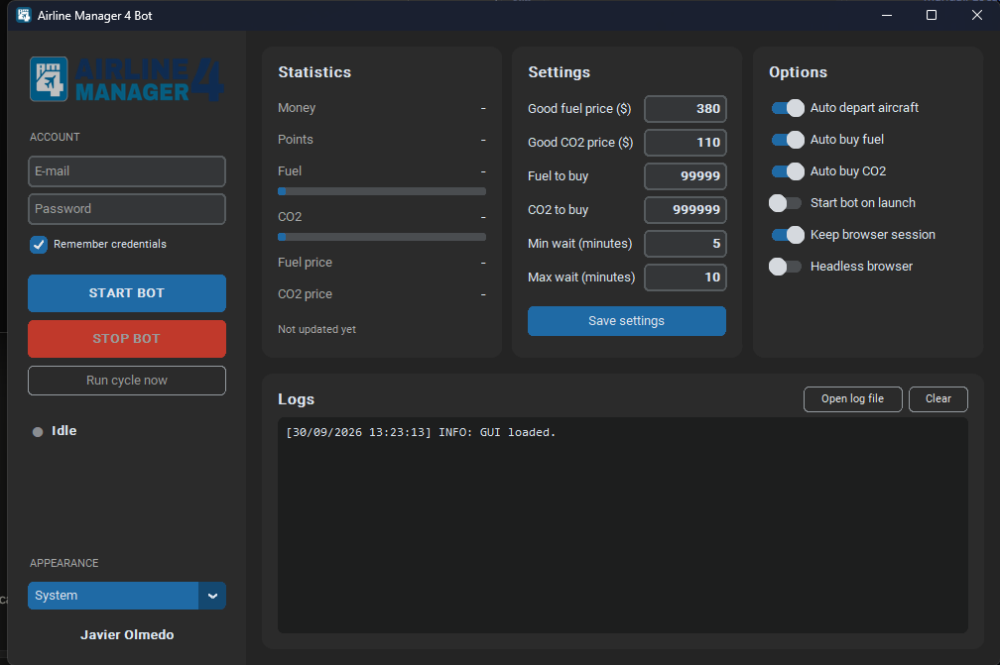

<div align="center">
    
    <h1>Airline Manager 4 Bot</h1>
    <p>Desktop bot for the web version of <a href="https://www.airlinemanager.com">Airline Manager 4</a>: departs your aircraft and buys fuel and CO2 when they are cheap.</p>
    
</div>

## Features

- ✔️ Auto depart all aircraft.
- ✔️ Auto buy fuel and CO2 when the price is at or below your threshold. Buys once per 30-minute price window and never more than your storage or your cash allow (when the game shows those values).
- ✔️ Live statistics (money, points, fuel, CO2, prices) and a log panel.
- ✔️ Random interval between checks, optional headless Chrome, optional persistent browser session so you only log in once.
- ✔️ Credentials live in `config/secrets.ini`, which is git-ignored.
- ❌ Autorepair (planned).
- ❌ Buying the most profitable aircraft (planned).

## Requirements

- Python 3.10 or newer.
- Google Chrome. Selenium Manager downloads the matching chromedriver by itself, nothing to install by hand.

## Install

```bash
git clone https://github.com/JavierOlmedo/AirlineManager4Bot.git
cd AirlineManager4Bot
python -m venv .venv
.venv\Scripts\activate        # Windows
source .venv/bin/activate     # macOS / Linux
pip install -r requirements.txt
```

## Run

```bash
python src/main.py
```

1. Type your e-mail and password in the sidebar. Leave them empty if you prefer to log in by hand in the Chrome window.
2. Adjust the thresholds and options.
3. Press **START BOT**.

You can also copy `config/secrets.example.ini` to `config/secrets.ini` and fill it in.

## Configuration

Everything else lives in `config/settings.ini`:

- `[settings]`: price thresholds, quantities, check interval, login timeout.
- `[options]`: the switches shown in the app.
- `[selectors]`: the XPath expressions used to find elements in the game. If the game changes its layout, fix them here, no code change required.

Logs are written to `data/logs/am4bot.log`.

## Notes

- The bot drives a real Chrome window with Selenium. If the site asks for a captcha, solve it by hand: the bot waits up to `login_timeout` seconds.
- With **Keep browser session** on, Chrome stores its profile in `config/session/` (git-ignored) so the "remember me" cookie survives between runs.
- Bots may be against the game's terms of service. Use at your own risk.

<div align="center">
    Made with ❤️ in Spain
</div>
